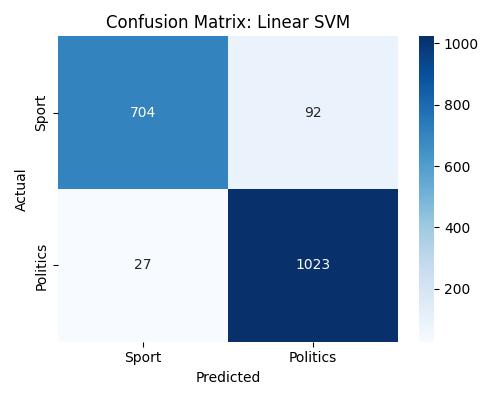

# 🏆 Sports vs. Politics Classifier


> **A High-Performance Text Classification System** > *Distinguishing between Sports and Politics news articles with 94%+ accuracy using NLP techniques.*

---

## 📑 Table of Contents
- [Project Overview](#-project-overview)
- [Key Features](#-key-features)
- [Model Performance](#-model-performance)
- [Visuals & Analysis](#-visuals--analysis)
- [Installation](#-installation)
- [About the Author](#-about-the-author)

---

## 📌 Project Overview
This project tackles the classic **Text Classification** problem using the **20 Newsgroups dataset**. The goal was to build a system that can automatically read a news article and determine if it belongs to the **Sports** (Baseball/Hockey) or **Politics** (Guns/Mideast/Misc) category.

We implemented and compared **6 different Machine Learning algorithms**, ranging from simple probabilistic models to complex ensemble methods.

### 🎯 Objective
* **Input:** Raw text string (e.g., *"The quarterback threw a touchdown..."*)
* **Output:** Class Label (`Sport` or `Politics`) + Confidence Score

---

## 🚀 Key Features
* **Text Preprocessing:** Automated tokenization, stop-word removal, and n-gram generation (1-2 words).
* **TF-IDF Vectorization:** Converts text into mathematical vectors, highlighting unique topic words.
* **Multi-Model Comparison:** Evaluates Naive Bayes, SVM, Logistic Regression, Random Forest, KNN, and Gradient Boosting.
* **Visualization:** Automatically generates confusion matrices for error analysis.

---

## 📊 Model Performance

We trained all models on **2,772 documents** and tested on **1,846 documents**. Here is the leaderboard:

| 🏆 Rank | Model Architecture | Accuracy | F1-Score |
|:---:|:--- |:---:|:---:|
| **1** | **Multinomial Naive Bayes** | **94.69%** | **0.95** |
| 2 | Linear SVM | 93.55% | 0.93 |
| 3 | Logistic Regression | 93.39% | 0.93 |
| 4 | K-Nearest Neighbors | 92.15% | 0.92 |
| 5 | Random Forest | 91.82% | 0.92 |
| 6 | Gradient Boosting | 86.35% | 0.85 |

> **Insight:** Naive Bayes performed best because it handles high-dimensional sparse data (like text) exceptionally well, even better than complex boosting algorithms in this specific scenario.

---

## 📈 Visuals & Analysis

Below are the **Confusion Matrices** showing exactly where the models got confused.

### Top Performer: Naive Bayes


### Runner Up: Linear SVM


*(See repository file list for other model charts)*

---

## 💻 Installation

Want to run this yourself? Clone the repo and run the classifier script.

```bash
# 1. Clone the repository
git clone [https://github.com/diwanshuydv/sports-vs-politics-classifier.git](https://github.com/diwanshuydv/sports-vs-politics-classifier.git)

# 2. Navigate to directory
cd sports-vs-politics-classifier

# 3. Install dependencies
pip install numpy scikit-learn matplotlib seaborn

# 4. Run the classifier
python classifier.py
```
